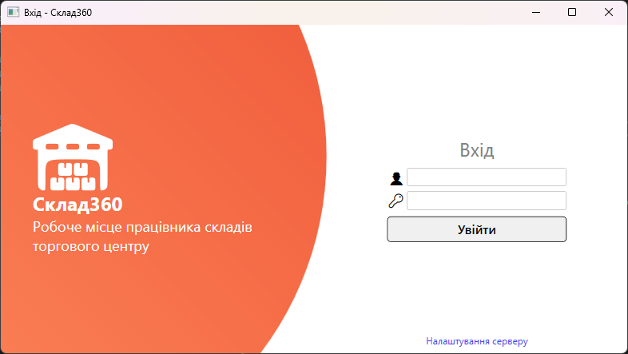
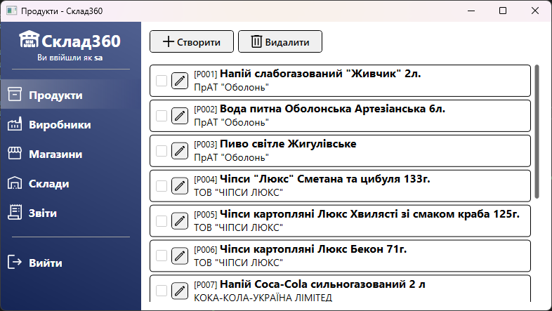
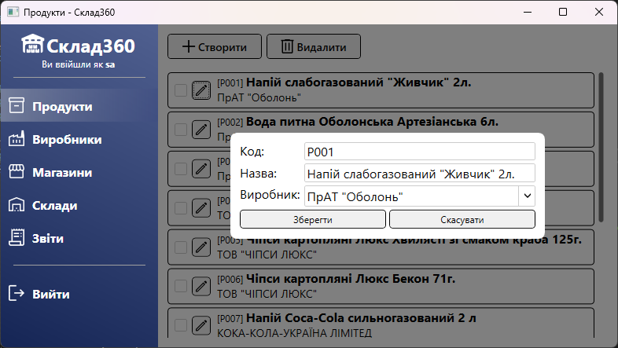
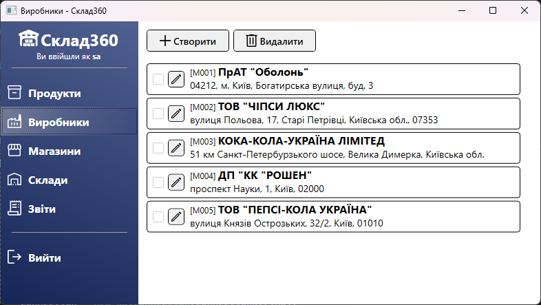
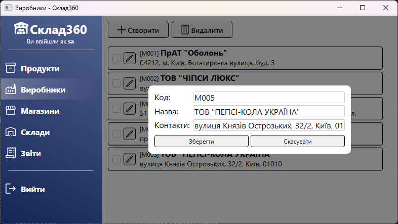
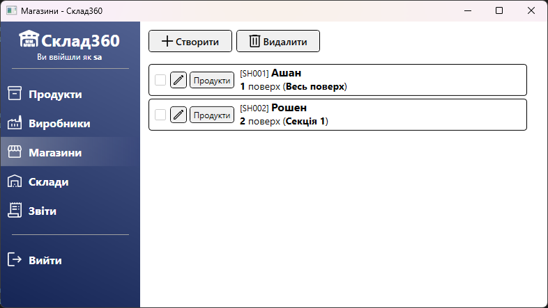
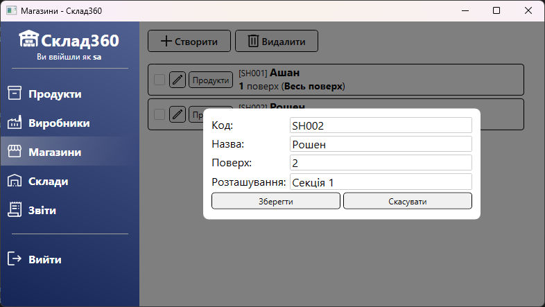
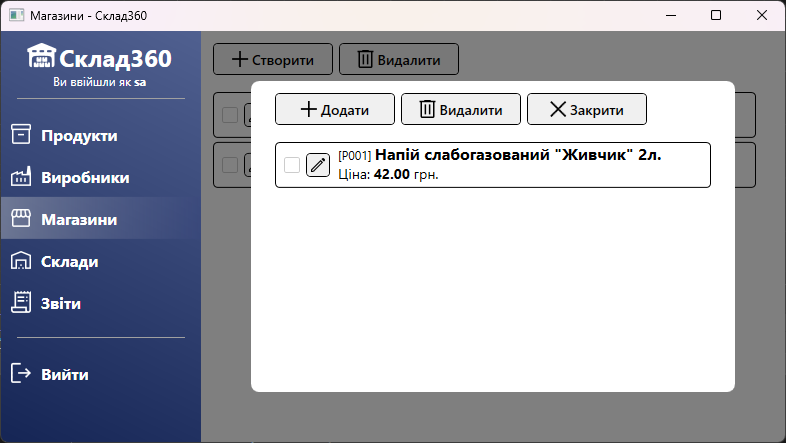
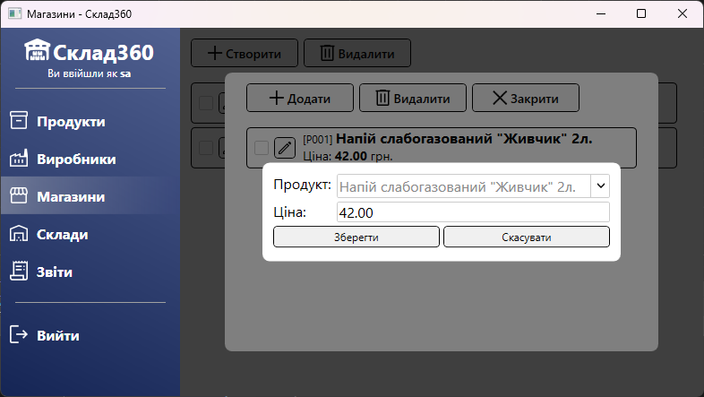

# АРМ працівника складу торгового центру
Курсовий проект з дисципліни "Організація баз даних" на тему "Автоматизоване робоче місце працівника складів торгового центру"

Проект розроблено на мові програмування C# з використанням технології WPF. Для зберігання даних використовується СУБД Microsoft SQL Server.

## Галерея

Форма входу

"Продукти"

Редагування продукту

"Виробники"

Редагування виробника

"Магазини"

Редагування магазину

Редагування товарів в магазині

Редагування ціни товару в магазині
